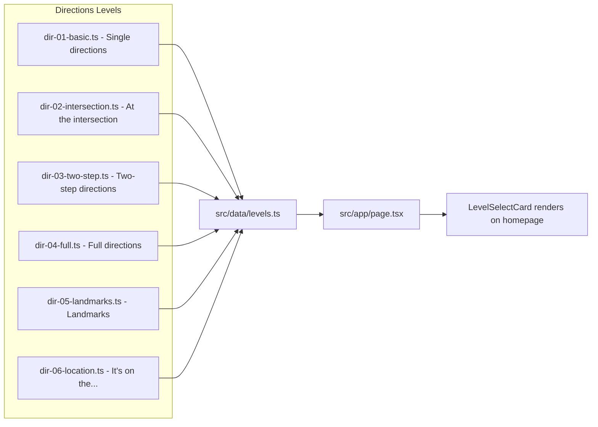

# Plan: Direction-Giving Levels

## Overview

Create level groups for teaching how to give and understand directions in Chinese. This is more complex than existing levels because directions often involve multi-step sequences.

## Chinese Direction Vocabulary

| Chinese | Pinyin | English | POS |
|---------|--------|---------|-----|
| 直走 | zhí zǒu | go straight | verb |
| 左转 | zuǒ zhuǎn | turn left | verb |
| 右转 | yòu zhuǎn | turn right | verb |
| 往前走 | wǎng qián zǒu | go forward | verb |
| 往回走 | wǎng huí zǒu | go back | verb |
| 一直走 | yī zhí zǒu | go straight ahead | verb |
| 然后 | rán hòu | then / after that | particle |
| 第一个路口 | dì yī gè lù kǒu | first intersection | noun |
| 第二个路口 | dì èr gè lù kǒu | second intersection | noun |
| 第三个路口 | dì sān gè lù kǒu | third intersection | noun |
| 在左边 | zài zuǒ biān | on the left | phrase |
| 在右边 | zài yòu biān | on the right | phrase |
| 在前面 | zài qián miàn | in front | phrase |
| 在后面 | zài hòu miàn | behind | phrase |
| 旁边 | páng biān | beside | noun |
| 对面 | duì miàn | opposite | noun |
| 路口 | lù kǒu | intersection | noun |
| 红绿灯 | hóng lǜ dēng | traffic light | noun |
| 拐角 | guǎi jiǎo | corner | noun |

## Approach: Progressive Complexity

Since the slot system handles individual sentences, I'll structure the levels progressively:

### Phase 1: Single Directions (Simple)
Each sentence is one simple direction. Pattern: `["verb"]` or `["adverb", "verb"]`

**Sub-level 1: `dir-01` — Basic Directions**
- 直走。 — "Go straight."
- 左转。 — "Turn left."
- 右转。 — "Turn right."
- 往前走。 — "Go forward."
- 往回走。 — "Go back."
- 一直走。 — "Go straight ahead."

**Pattern:** `["verb"]` — single slot, the direction verb is quizzed
**Distractors:** Other direction verbs

### Phase 2: Location + Direction
Directions that specify where to turn. Pattern: `["particle", "noun", "verb"]`

**Sub-level 2: `dir-02` — At the Intersection**
- 在第一个路口左转。 — "Turn left at the first intersection."
- 在第二个路口右转。 — "Turn right at the second intersection."
- 在第三个路口直走。 — "Go straight at the third intersection."
- 在第一个路口右转。 — "Turn right at the first intersection."
- 在第二个路口左转。 — "Turn left at the second intersection."
- 在红绿灯往前走。 — "Go forward at the traffic light."

**Pattern:** `["particle", "noun", "verb"]`
- Slot 1: 在 — particle, auto-detected as fixed
- Slot 2: location noun (路口/红绿灯) — quizzed
- Slot 3: direction verb — quizzed

### Phase 3: Two-Step Directions
Directions with two steps connected by 然后. Pattern: `["verb", "particle", "verb"]`

**Sub-level 3: `dir-03` — Two-Step Directions**
- 直走，然后左转。 — "Go straight, then turn left."
- 直走，然后右转。 — "Go straight, then turn right."
- 左转，然后直走。 — "Turn left, then go straight."
- 右转，然后直走。 — "Turn right, then go straight."
- 往前走，然后左转。 — "Go forward, then turn left."
- 一直走，然后右转。 — "Go straight ahead, then turn right."

**Pattern:** `["verb", "particle", "verb"]`
- Slot 1: first direction verb — quizzed
- Slot 2: 然后 — particle, auto-detected as fixed
- Slot 3: second direction verb — quizzed

### Phase 4: Location + Two-Step
Full directions with location and two steps. Pattern: `["particle", "noun", "verb", "particle", "verb"]`

**Sub-level 4: `dir-04` — Full Directions**
- 在第一个路口左转，然后直走。 — "Turn left at the first intersection, then go straight."
- 在第二个路口右转，然后直走。 — "Turn right at the second intersection, then go straight."
- 在第一个路口右转，然后左转。 — "Turn right at the first intersection, then turn left."
- 在红绿灯左转，然后直走。 — "Turn left at the traffic light, then go straight."
- 在第二个路口左转，然后右转。 — "Turn left at the second intersection, then turn right."
- 在第三个路口右转，然后直走。 — "Turn right at the third intersection, then go straight."

**Pattern:** `["particle", "noun", "verb", "particle", "verb"]`
- Slot 1: 在 — particle, auto-detected as fixed
- Slot 2: location noun — quizzed
- Slot 3: first direction — quizzed
- Slot 4: 然后 — particle, auto-detected as fixed
- Slot 5: second direction — quizzed

### Phase 5: Landmark-Based Directions
Directions using landmarks. Pattern: `["particle", "noun", "verb", "particle", "noun"]`

**Sub-level 5: `dir-05` — Landmarks**
- 在医院左转。 — "Turn left at the hospital."
- 在学校右转。 — "Turn right at the school."
- 在商店直走。 — "Go straight at the store."
- 在公园左转，然后直走。 — "Turn left at the park, then go straight."
- 在图书馆右转，然后直走。 — "Turn right at the library, then go straight."
- 在医院右转，然后左转。 — "Turn right at the hospital, then turn left."

**Pattern:** Same as dir-04 but using landmark nouns instead of 路口/红绿灯

### Phase 6: "It's on your..." — Final Location
Describing where something is located. Pattern: `["particle", "noun"]`

**Sub-level 6: `dir-06` — It's on the...**
- 在左边。 — "It's on the left."
- 在右边。 — "It's on the right."
- 在前面。 — "It's in front."
- 在后面。 — "It's behind."
- 在对面。 — "It's opposite."
- 在旁边。 — "It's beside."

**Pattern:** `["particle", "noun"]`
- Slot 1: 在 — particle, auto-detected as fixed
- Slot 2: location noun — quizzed

## Files to Create

1. `src/data/levels/dir/dir-01-basic.ts`
2. `src/data/levels/dir/dir-02-intersection.ts`
3. `src/data/levels/dir/dir-03-two-step.ts`
4. `src/data/levels/dir/dir-04-full-directions.ts`
5. `src/data/levels/dir/dir-05-landmarks.ts`
6. `src/data/levels/dir/dir-06-location.ts`

## Files to Modify

### 7. `src/data/wordBank.ts`
- Add direction vocabulary (直走, 左转, 右转, 往前走, 往回走, 一直走, 然后, 路口, 红绿灯, 拐角, 左边, 右边, 前面, 后面, 旁边, 对面, 第一个, 第二个, 第三个)

### 8. `src/data/levels.ts`
- Add imports for all 6 new levels
- Add them to the `allLevels` array

### 9. `src/app/page.tsx`
- Add filter for direction levels
- Add a new `<section>` block

## Architecture

## Key Design Decisions

1. **Progressive complexity** — Levels start simple (single direction) and build up to multi-step directions with locations.

2. **Different pattern structures** — Each phase uses a different pattern structure to match the sentence complexity:
   - dir-01: `["verb"]` — simplest, just the direction
   - dir-02: `["particle", "noun", "verb"]` — location + direction
   - dir-03: `["verb", "particle", "verb"]` — two-step with 然后
   - dir-04/05: `["particle", "noun", "verb", "particle", "verb"]` — full directions
   - dir-06: `["particle", "noun"]` — final location

3. **Fixed particles** — 在 and 然后 are auto-detected as fixed since they're the same across all sentences in their respective levels.

4. **6 sub-levels** — More than usual because directions need progressive scaffolding.

## Implementation Order

1. Add direction vocabulary to `src/data/wordBank.ts`
2. Create `src/data/levels/dir/` directory
3. Create 6 dir level files
4. Update `src/data/levels.ts` to register all 6 levels
5. Update `src/app/page.tsx` to add the new section
6. Test everything works
